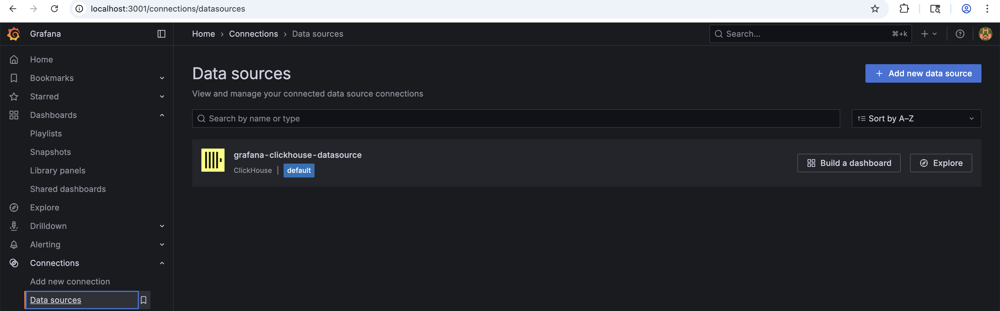
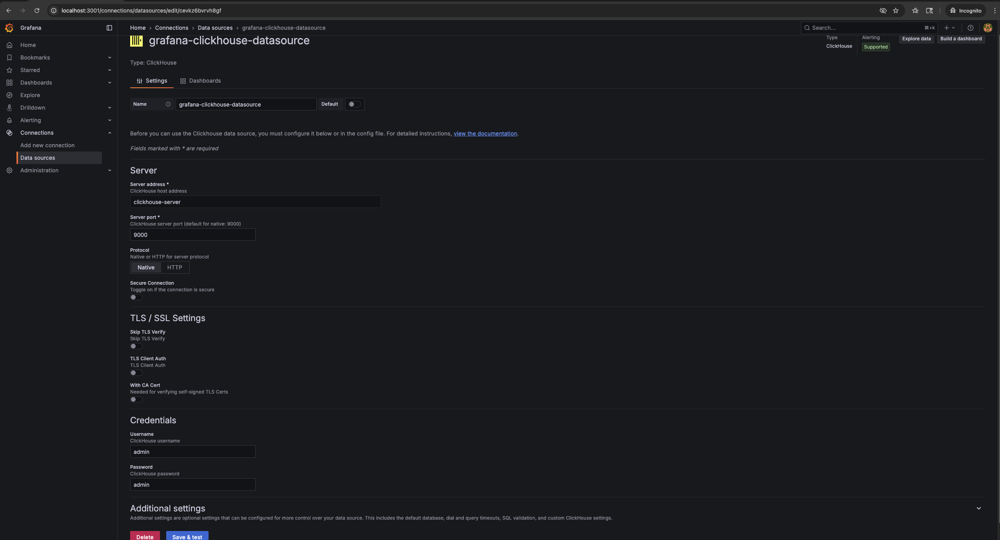
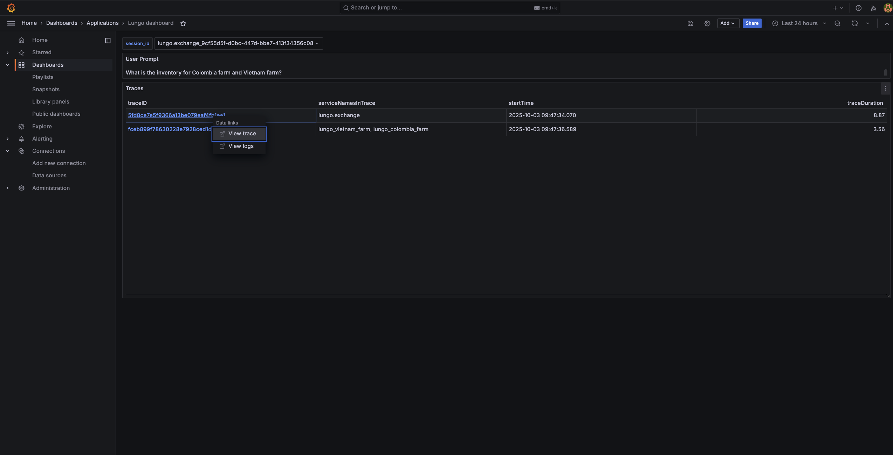

# Exploring FruitAGNTCY ☕️

Welcome! This hands-on tutorial combines **multiple reference apps** based on a fictitious fruit company navigating
supply chain use cases to showcase how components in the **AGNTCY Internet of Agents** are meant to work together.

You will:

1. Interact with **two demos** (FruitCognition Auction, FruitCognition Logistic)
2. Spin up the demo stack with docker compose
3. Use **preconfigured prompts** (and your own)
4. Explore **traces and metrics**

## Prerequisites

- **Docker** + **Docker Compose**
- **Node.js ≥ 16.14.0** (if you run any UI locally outside of Docker)
- **uv** (Python environment manager)

**IDE setup for CI (lint/format):** To run ESLint and Prettier on save or before commit, **Cursor is recommended**. In Cursor: enable **Format on Save** (Settings → search “format on save”) and ensure the ESLint extension is enabled; set the workspace root or open the `fruitAGNTCY/fruit_agents/fruit_cognition/frontend` folder so that `npm run lint:check` and `npm run format:check` apply to the FruitCognition frontend. You can also run these scripts from the terminal in that directory. The same checks run in CI (see `.github/workflows/fe-ci.yaml`, job `frontend-build`).

Clone the FruitAGNTCY repository:
```bash
git clone https://github.com/kubeages/fruitCognition.git
cd fruitCognition
```

## Repo Layout

```
fruitAGNTCY/
  fruit_agents/
    fruit_cognition/
      agents/
        supervisors/      # Auction and Logistic supervisors
        farms/            # Brazil/Colombia/Vietnam farms
        logistics/        # Logistics farm, accountant, helpdesk, and shipper
        mcp_servers/      # Weather MCP server
      docker-compose.yml  # FruitCognition Docker Compose

    recruiter/            # Standalone recruiter agent (Google ADK + AGNTCY dirctl)
```

## FruitCognition Auction & Logistics

### 1. Setup

```bash
cd fruitAGNTCY/fruit_agents/fruit_cognition
```

```bash
cp .env.example .env
```

Update your .env file with the provider model, credentials, and OTEL endpoint.

FruitAGNTCY uses litellm to manage LLM connections. With litellm, you can seamlessly switch between different model
providers using a unified configuration interface. Below are examples of environment variables for setting up various
providers. For a comprehensive list of supported providers, see the [official litellm
documentation](https://docs.litellm.ai/docs/providers).

In FruitAGNTCY, the environment variable for specifying the model is always LLM_MODEL, regardless of the provider.

   > ⚠️ **Note:** The `/agent/prompt/stream` endpoint requires an LLM that supports streaming. If your LLM provider does
   > not support streaming, the streaming endpoint may fail.

   Then update `.env` with your LLM provider, credentials and OTEL endpoint. For example:

---

#### **OpenAI**

```env
LLM_MODEL="openai/<model_of_choice>"
OPENAI_API_KEY=<your_openai_api_key>
```

---

#### **Azure OpenAI**

```env
LLM_MODEL="azure/<your_deployment_name>"
AZURE_API_BASE=https://your-azure-resource.openai.azure.com/
AZURE_API_KEY=<your_azure_api_key>
AZURE_API_VERSION=<your_azure_api_version>
```

---

#### **GROQ**

```env
LLM_MODEL="groq/<model_of_choice>"
GROQ_API_KEY=<your_groq_api_key>
```

---

#### **Litellm Proxy**

```env
LLM_MODEL="litellm_proxy/azure/<your_deployment_name>"
LITELLM_PROXY_BASE_URL=<your_litellm_proxy_base_url>
LITELLM_PROXY_API_KEY=<your_litellm_proxy_api_key>
```

---

#### **NVIDIA NIM**

```env
LLM_MODEL="nvidia_nim/<model_of_choice>"
NVIDIA_NIM_API_KEY=<your_nvidia_api_key>
NVIDIA_NIM_API_BASE=<your_nvidia_nim_endpoint_url>
```

### 2. Launch the Demo Stack

All workshop services are containerized — start everything with one command:

```bash
docker compose up --build
```

The observability stack (Grafana, OTEL Collector, ClickHouse) is started when the `observability` profile is included in `COMPOSE_PROFILES` (or as a part of the `-- profile` switch in the compose command). for it to work, `OTEL_SDK_DISABLED` should remain usnet OR set to false. Using the profile without the env var means no telemetry is sent; using the env var without the profile can cause log noise and failed exports.

This will start:
- The **Auction** and **Logistic** agents
- The **UI** frontends
- The **SLIM and NATS message buses** for agent-to-agent communication
- The **observability stack** (when the `observability` profile is enabled)

Once containers are running, open:

- **Auction and Logistic Demos:** [http://localhost:3000/](http://localhost:3000/)
- **Grafana Dashboard:** [http://localhost:3001/](http://localhost:3001/)

### 3. Interact with the Demos

Each demo UI lets you send prompts to an agentic system. Predefined prompts are provided to help you start — but you can
also type your own.

#### 🏷️ Auction Demo (Supervisor–Worker Pattern)

On the frontend select the `Conversation: Fruit Buying / Agentic Patterns / Publish Subscribe / A2A NATS` menu item.

This demo models a **Fruit Exchange** where a **Supervisor Agent** manages multiple **Fruit Farm Agents**. The
supervisor can communicate with all farms through a single outbound message using a **pub/sub communication model**.

**Example prompts:**
- `Show me the total inventory across all farms`
- `How much fruit does the Colombia farm have?`
- `I need 50 lb of fruit beans from Colombia for 0.50 cents per lb`

The transport layer in this demo is **interchangeable**, powered by **AGNTCY’s App SDK**, enabling agents to switch
between different transports or agentic protocols with minimal code changes.

All agents are registered with **AGNTCY’s Identity Service**, which integrates with various Identity Providers. This
service acts as a **central hub for managing and verifying digital identities**, allowing agentic services to register,
establish unique identities, and validate authenticity through identity badges. In this demo, the **Colombia** and
**Vietnam** farms are verified with the Identity Service. The **Supervisor Agent** validates each farm’s badge before
sending any orders. Try sending an order to the **Brazil farm** to see what happens when the target agent is
**unverified**: `I need 50 lb of fruit beans from Brazil for 0.50 cents per lb`

Check out the supervisor agent’s [tools](fruitAGNTCY/fruit_agents/fruit_cognition/agents/supervisors/auction/graph/tools.py) to
see how it integrates with the **App SDK** and **Identity Service**.

**Observe in your Docker Compose logs how:**
- The supervisor delegates requests to individual farms
- Responses are aggregated across agents
- Broadcast vs. unicast messaging is handled automatically

#### 🚚 Logistic Demo (Coordination/ Group Chat Pattern)

On the frontend select the `Conversation: Order fulfillment / Agentic Patterns / Secure Group Communication / A2A SLIM`
menu item.

This demo showcases a **supply coordination** scenario where agents communicate within a **group chat**. In this setup,
the **Supervisor Agent** acts as the moderator, inviting various **logistics components** as members and enabling them
to communicate directly with one another.

**Example prompt:**
- `I want to order fruit at $3.50 per pound for 500 lbs from the Tatooine farm`

This style of agentic communication is powered by **AGNTCY’s SLIM**. Unlike the **Auction flow**, this transport is
**not interchangeable**, as **SLIM** is the only protocol that supports **multi-agent group chat communication**.

Explore the [`Logistic Supervisor tools`](fruitAGNTCY/fruit_agents/fruit_cognition/agents/supervisors/logistic/graph/tools.py)
to see how the supervisor initializes and manages the SLIM group chat.

**Observe** how agents coordinate and negotiate within the chat, collaborating to complete their designated tasks and
share updates dynamically.

### 4. Inspect Traces in Grafana


Observability works only when both the `observability` profile is defined (either in `COMPOSE_PROFILES`, or by the `--profile` switch) and if OTEL SDK is enabled (treated as enabled by default, but can be made explicit by `OTEL_SDK_DISABLED=false`).
Once you’ve executed a few prompts:

1. Go to [http://localhost:3001/](http://localhost:3001/)
2. Log in with:
   ```
   Username: admin
   Password: admin
   ```
3. **Connect/Add the ClickHouse Datasource**

   - In the left sidebar, click on **"Connections" > "Data sources"**.
   - If not already present, add a new **ClickHouse** datasource with the following settings:
     - **Server address:** `clickhouse-server`
     - **Port:** `9000`
     - **Protocol:** `native`
     - **User/Password:** `admin` / `admin`
   - If already present, select the **ClickHouse** datasource (pre-configured in the Docker Compose setup).

   
   

4. **Import the OTEL Traces Dashboard**

   - In the left sidebar, click on **"Dashboards" > "New" > "Import"**.
   - Upload or paste the JSON definition for the OTEL traces dashboard, located here:
     [`fruit_cognition_dashboard.json`](fruitAGNTCY/fruit_agents/fruit_cognition/fruit_cognition_dashboard.json)
   - **When prompted, select `grafana-clickhouse-datasource` as the datasource.**
   - Click **"Import"** to add the dashboard.

   

5. **View Traces**

   - Navigate to the imported dashboard.
   - You should see traces and spans generated by the FruitCognition agents as they process requests.
   - **To view details of a specific trace, click on a TraceID in the dashboard. This will open the full trace and its
     spans for further inspection.**

    
6. Explore:
   - **Trace timelines** showing how each agent processed your prompt
   - **Span hierarchies** (Supervisor → Farm or Logistics Agents)
   - Latencies and tool calls between components

> Tip: Click any **Trace ID** to open the full trace and visualize agent interactions end-to-end.

### 5. Cleanup

When done, stop all containers:

```bash
docker compose down
```

## Recap

In this workshop, you:
- Deployed FruitCognition’s **Auction** and **Logistic** demos via Docker Compose and explored supervisor-worker and group chat
  agentic patterns
- Interacted with real-time **agentic UIs**
- Observed communication traces in **Grafana**
- Understood how different **A2A communication patterns** emerge from design
- Explored code that shows how agents integrate with **AGNTCY SLIM, Observe, & Agent Identity** components directly or
  via the **App SDK**

### References
- [AGNTCY App SDK](https://github.com/agntcy/app-sdk)
- [AGNTCY SLIM](https://github.com/agntcy/slim)
- [AGNTCY Observe](https://github.com/agntcy/observe)
- [AGNTCY Identity Service](https://github.com/agntcy/identity-service)