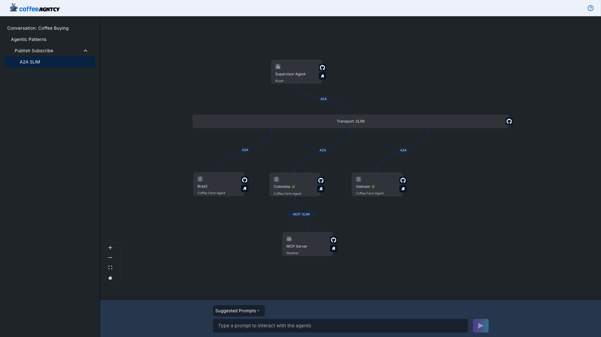
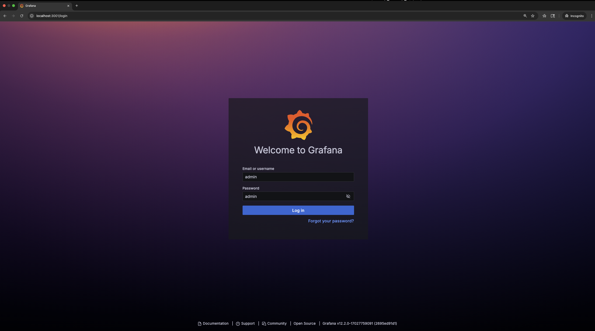
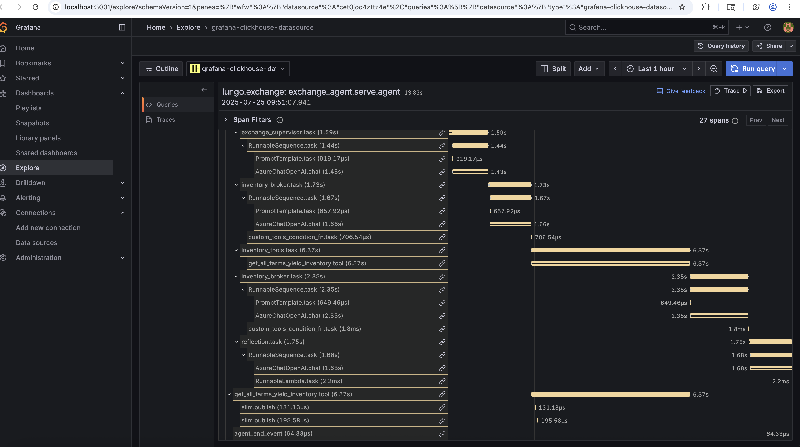
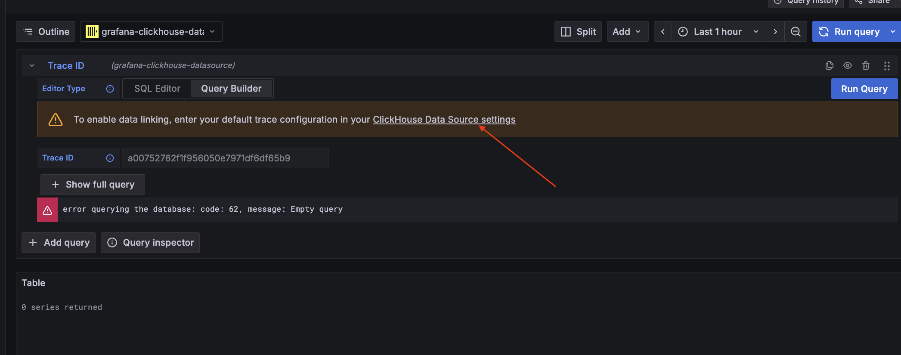
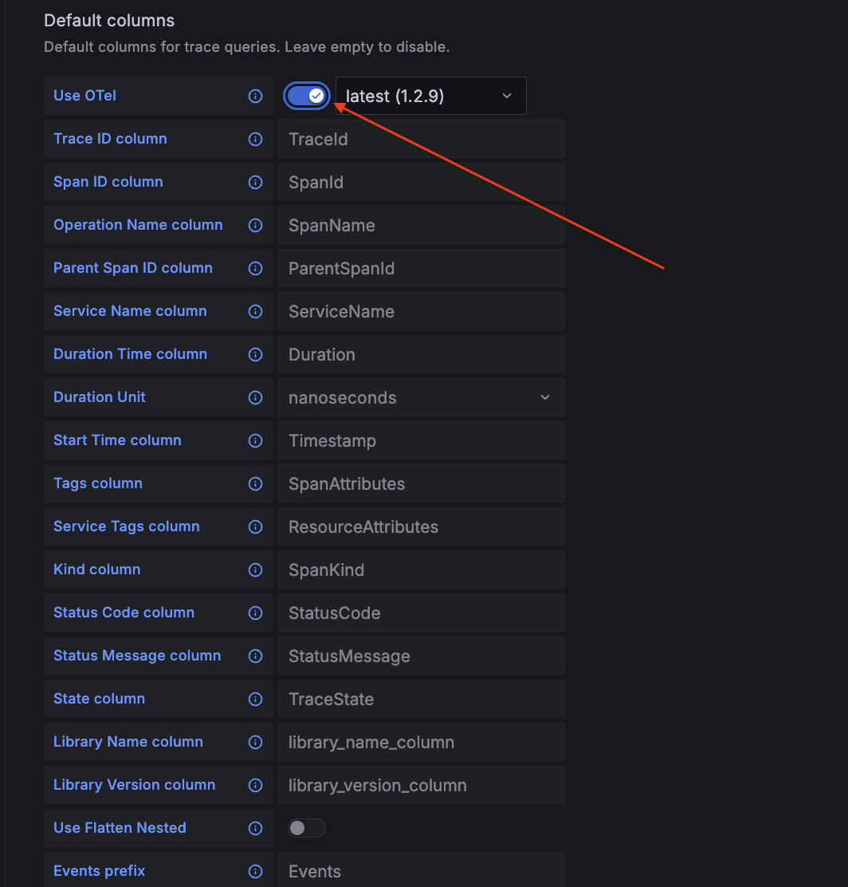

<!-- TOC -->
  * [FruitCognition Demo Overview](#fruit-cognition-demo-overview)
    * [Overview](#overview)
  * [Running FruitCognition Locally](#running-fruit-cognition-locally)
    * [Prerequisites](#prerequisites)
    * [Setup Instructions](#setup-instructions)
      * [**OpenAI**](#openai)
      * [**Azure OpenAI**](#azure-openai)
      * [**GROQ**](#groq)
      * [**NVIDIA NIM**](#nvidia-nim)
      * [**LiteLLM Proxy**](#litellm-proxy)
      * [**Custom OAuth2 Application Exposing OpenAI**](#custom-oauth2-application-exposing-openai)
    * [Execution](#execution)
      * [Option 1: Docker Compose (Recommended)](#option-1-docker-compose-recommended)
      * [Option 2: Local Python Development](#option-2-local-python-development)
      * [Option 3: Local Kind Cluster Deployment](#option-3-local-kind-cluster-deployment)
    * [Recruiter Supervisor](#recruiter-supervisor)
    * [Group Conversation Implementation](#group-conversation-implementation)
    * [Observability](#observability)
      * [Trace Visualization via Grafana](#trace-visualization-via-grafana)
    * [Adding a New Farm Agent](#adding-a-new-farm-agent)
      * [Metrics Computation with AGNTCY's Metrics Computation Engine (MCE)](#metrics-computation-with-agntcys-metrics-computation-engine-mce)
<!-- TOC -->

## FruitCognition Demo Overview

The **FruitCognition Demo** is a continuously evolving showcase of interoperable open-source agentic components. Its primary goal is to demonstrate how different components—from the **Agntcy** project and other open-source ecosystems—can work together seamlessly.

### Overview

The current demo models a **supervisor-worker agent ecosystem**, where:

- The **Supervisor Agent** acts as a _Fruit Exchange_, responsible for managing inventory and fulfilling orders.
- The **Worker Agents** represent _Fruit Farms_, which supply the inventory and provide order information.

All agents are implemented as **directed LangGraphs** with **Agent-to-Agent (A2A)** integration. The user interface communicates with the Supervisor’s API to submit prompts. These prompts are processed through the LangGraph and routed via an A2A client to the appropriate Farm’s A2A server.

The underlying A2A transport is configurable. By default, it uses **SLIM**, supporting both broadcast and unicast messaging depending on the context and data requirements.

One notable component is the **Colombia Farm**, which functions as an **MCP client**. It communicates with an MCP server (over SLIM) to retrieve real-time weather data used to calculate fruit yield.

## Running FruitCognition Locally

You can run FruitCognition in three ways:

1. **Local Python**
   Run each component directly on your machine.

2. **Docker Compose**
   Quickly spin up all components as containers using Docker Compose.

3. **Local Kind Cluster**
	Deploy the full stack to a local Kubernetes cluster using KinD (Kubernetes in Docker)

### Prerequisites

Before you begin, ensure the following tools are installed:

- **uv**: A Python package and environment manager.
  Install via Homebrew:

  ```sh
  brew install uv
  ```

- **Node.js** version **16.14.0 or higher**
  Check your version:
  ```sh
  node -v
  ```
  If not installed, download it from the [official Node.js website](https://nodejs.org/).

**Additional prerequisites for Kind deployment:**

- **Docker**: Required to run kind clusters
- **kind**: Kubernetes in Docker
  Install via Homebrew:
```sh
  brew install kind
```

- **kubectl**: Kubernetes command-line tool
  Install via Homebrew:
```sh
  brew install kubectl
```

- **helm**: Kubernetes package manager
  Install via Homebrew:
```sh
  brew install helm
```

- **helmfile**: Declarative Helm chart deployment
  Install via Homebrew:
```sh
  brew install helmfile
```

---

### Setup Instructions

1. **(Optional) Create a Virtual Environment**
   Initialize your virtual environment using `uv`:

   ```sh
   uv venv
   source .venv/bin/activate
   ```

2. **Install Python Dependencies**
   Use `uv` to install all required dependencies:

   ```sh
   uv sync
   ```

   Navigate to the FruitCognition project directory, set the PYTHONPATH environment variable to the root directory of the fruit_cognition project. This is necessary for running the application locally.

   ```sh
   # In the fruit_cognition root directory
   export PYTHONPATH=$(pwd)
   ```

3. **Configure Environment Variables**
    Copy the example environment file:

   ```sh
   cp .env.example .env
   ```

   **UI environment**

   **`VITE_*`** for the web UI live only in **`frontend/.env`** (see **`frontend/.env.example`**) — used by **`npm run dev`** and when you run **`docker compose --profile frontend up --build`**. **`fruit_cognition/.env`** is for backends, LLM keys, and Compose profiles only.

**Configure LLM Model, Credentials and OTEL endpoint**

Update your .env file with the provider model, credentials, and OTEL endpoint.

**Observability:** To use the observability stack (Grafana, OTEL Collector, ClickHouse), set `COMPOSE_PROFILES` to include `observability` (or add them alternatively, e.g. listing `farms,logistics,recruiter,observability` for the `up` command, or add `--profile observability` to the `compose` command) and set `OTEL_SDK_DISABLED=false` (or leave unset). To run without the stack, omit `observability` from `COMPOSE_PROFILES` and set `OTEL_SDK_DISABLED=true`. Using the observability profile without enabling telemetry (`OTEL_SDK_DISABLED=true`) means the stack runs but no telemetry is sent; using telemetry (`OTEL_SDK_DISABLED=false`) without the observability profile can cause log noise and failed telemetry exports.

FruitAGNTCY uses litellm to manage LLM connections. With litellm, you can seamlessly switch between different model providers using a unified configuration interface. Below are examples of environment variables for setting up various providers. For a comprehensive list of supported providers, see the [official litellm documentation](https://docs.litellm.ai/docs/providers).

In FruitAGNTCY, the environment variable for specifying the model is always LLM_MODEL, regardless of the provider.

   > ⚠️ **Note:** The `/agent/prompt/stream` endpoint requires an LLM that supports streaming. If your LLM provider does not support streaming, the streaming endpoint may fail.

   Then update `.env` with your LLM provider, credentials and OTEL endpoint. For example:

---

#### **OpenAI**

```env
LLM_MODEL="openai/<model_of_choice>"
OPENAI_API_KEY=<your_openai_api_key>
```

---

#### **Azure OpenAI**

```env
LLM_MODEL="azure/<your_deployment_name>"
AZURE_API_BASE=https://your-azure-resource.openai.azure.com/
AZURE_API_KEY=<your_azure_api_key>
AZURE_API_VERSION=<your_azure_api_version>
```

---

#### **GROQ**

```env
LLM_MODEL="groq/<model_of_choice>"
GROQ_API_KEY=<your_groq_api_key>
```

---

#### **NVIDIA NIM**

```env
LLM_MODEL="nvidia_nim/<model_of_choice>"
NVIDIA_NIM_API_KEY=<your_nvidia_api_key>
NVIDIA_NIM_API_BASE=<your_nvidia_nim_endpoint_url>
```

---

#### **LiteLLM Proxy**

If you're using a LiteLLM proxy to route requests to various LLM providers:

```env
LLM_MODEL="azure/<your_deployment_name>"
LITELLM_PROXY_BASE_URL=<your_litellm_proxy_base_url>
LITELLM_PROXY_API_KEY=<your_litellm_proxy_api_key>
```

---

#### **Custom OAuth2 Application Exposing OpenAI**

If you’re using a application secured with OAuth2 + refresh token that exposes an OpenAI endpoint:

```env
LLM_MODEL=oauth2/<your_llm_model_here>
OAUTH2_CLIENT_ID=<your_client_id>
OAUTH2_CLIENT_SECRET=<your_client_secret>
OAUTH_TOKEN_URL="https://your-auth-server.com/token"
OAUTH2_BASE_URL="https://your-openai-endpoint"
OAUTH2_APP_KEY=<your_app_key> #optional
```

---

   _OTEL:_ Set `OTEL_SDK_DISABLED=false` (or unset) to enable tracing; this variable is used by OTEL-based 3rd-party libs. When tracing is enabled, set the OTLP endpoint:

   ```env
   OTLP_HTTP_ENDPOINT="http://localhost:4318"
   ```

   **Optional: Configure Transport Layer**

   FruitCognition reads transport settings from `config/config.py`. The primary variables are:

   ```env
   DEFAULT_MESSAGE_TRANSPORT=SLIM
   SLIM_SERVER=127.0.0.1:46357
   NATS_SERVER=127.0.0.1:4222
   SLIM_SHARED_SECRET=my_shared_secret_for_mls
   ```

   - `DEFAULT_MESSAGE_TRANSPORT`: `SLIM` or `NATS` (Docker Compose defaults to **SLIM**).
   - `SLIM_SERVER`: Host and port for the SLIM dataplane only (no `http://` prefix); used in agent cards and RPC URLs.
   - `NATS_SERVER`: Host and port for NATS; cards reference `nats://{NATS_SERVER}/...`.
   - `SLIM_SHARED_SECRET`: Shared secret for the SLIM gateway.

   For backward compatibility and tooling, you can still set `TRANSPORT_SERVER_ENDPOINT` (for example `http://localhost:46357` when using SLIM, or `nats://localhost:4222` when using NATS). Prefer keeping it consistent with `SLIM_SERVER` / `NATS_SERVER` and `DEFAULT_MESSAGE_TRANSPORT`.

   For a list of supported protocols and implementation details, see the [Agntcy App SDK README](https://github.com/agntcy/app-sdk). This SDK provides the underlying interfaces for building communication bridges and agent clients.

**Enable Observability with Observe SDK**

Make sure the following Python dependency is installed:

```
ioa-observe-sdk==1.0.24
```

For advanced observability of your multi-agent system, integrate the [Observe SDK](https://github.com/agntcy/observe/blob/main/GETTING-STARTED.md).

- Use the following decorators to instrument your code:

  - `@graph(name="graph_name")`: Captures MAS topology state for observability.
  - `@agent(name="agent_name", description="Some description")`: Tracks individual agent nodes and activities.
  - `@tool(name="tool_name", description="Some description")`: Monitors tool usage and performance.

- **To enable tracing for the FruitCognition multi-agent system:** Set `OTEL_SDK_DISABLED=false` in your environment (or in `.env`). The app derives `enable_tracing` from this; no code change is required.

- **To start a new trace session for each prompt execution:**
  Call `session_start()` at the beginning of each prompt execution to ensure each prompt trace is tracked as a new session:

  ```python
  from ioa_observe_sdk import session_start

  # At the start of each prompt execution
  session_start()
  ```

---

### Execution

> **Note:** You can run FruitCognition using one of three methods:
>
> 1. **Docker Compose** (Recommended for quick start) - see below
> 2. **Local Python** - Running each component individually
> 3. **Local Kind Cluster** - Full Kubernetes deployment
>
> Choose the method that best fits your development workflow.

#### Option 1: Docker Compose (Recommended)

From **`fruit_cognition/`**, run:

```sh
docker compose up --build
```

Compose reads **`COMPOSE_PROFILES`** in **`fruit_cognition/.env`** (see **`.env.example`**) to decide which profiled services start, including whether the **`ui`** container runs.

##### Web UI: `COMPOSE_PROFILES` vs local Vite

- **Frontend development (hot reload):** Remove **`frontend`** from **`COMPOSE_PROFILES`** in **`fruit_cognition/.env`** so Compose does not start the **`ui`** container (otherwise port **3000** is used twice). Run **`docker compose up --build`** from **`fruit_cognition/`**, then in **`frontend/`** run **`npm run dev`** with **`frontend/.env`** configured (**`VITE_*`**).
- **UI only in Docker:** Keep **`frontend`** in **`COMPOSE_PROFILES`** (as in **`.env.example`**). Run **`docker compose up --build`** from **`fruit_cognition/`** only; the **`ui`** container needs **`frontend/.env`**.

You can still enable the UI ad hoc without editing **`.env`** using **`docker compose --profile frontend up --build`** — see [Step 5](#step-5-access-the-ui).

**Using Profiles**

The docker-compose file is organized into profiles for running specific subsets of services:

| Profile | Services |
|---------|----------|
| `frontend` | **ui** (port 3000; env: **`frontend/.env`** only for **`VITE_*`**) |
| `farms` | brazil-farm-server, colombia-farm-server, vietnam-farm-server, auction-supervisor, weather-mcp-server, payment-mcp-server |
| `logistics` | slim, logistics-shipper, logistics-accountant, logistics-farm, logistics-helpdesk, logistics-supervisor |
| `recruiter` | recruiter, recruiter-supervisor, postgres, dir-api-server, dir-mcp-server, zot |

Run a specific profile:
```sh
# Run only farms
docker compose --profile farms up

# Run only logistics
docker compose --profile logistics up

# Run only recruiter
docker compose --profile recruiter up

# Run all profiles
docker compose --profile farms --profile logistics --profile recruiter up

# Run the UI in Docker (optional; otherwise use npm run dev in frontend/)
docker compose --profile frontend up --build
```

If you started services with one or more profiles, run `docker compose down` with the **same profile(s)** (e.g. `docker compose --profile farms down`) or tear everything down with `docker compose --profile '*' down`. Do not run a bare `docker compose down` (no profile): it only stops unprofiled services and the network removal will fail with "Network ... Resource is still in use."

> **Note:** The **ui** service uses the **`frontend`** profile; it runs only when that profile is active (e.g. **`frontend`** in **`COMPOSE_PROFILES`** or **`--profile frontend`**). **`.env.example`** includes **`frontend`**, so a copied **`.env`** starts the UI in Docker unless you remove it. Shared infrastructure (e.g. nats) has no profile. The observability stack (clickhouse-server, otel-collector, grafana, mce-api-layer, metrics-computation-engine) uses the `observability` profile; include it in `COMPOSE_PROFILES` (e.g. in `.env`) to start those services.

The containerized UI uses **`frontend/.env`** only for **`VITE_*`** (see **`ui`** in **`docker-compose.yaml`**). Run **`cp frontend/.env.example frontend/.env`** before **`docker compose --profile frontend up --build`** if you have not already.

Once running:
- **UI (Vite):** `cd frontend && cp .env.example .env && npm run dev` → [http://localhost:3000](http://localhost:3000) — with Docker backends, omit **`frontend`** from **`COMPOSE_PROFILES`** (see **Web UI: `COMPOSE_PROFILES` vs local Vite** above).
- **UI (Docker):** include **`frontend`** in **`COMPOSE_PROFILES`** or use **`docker compose --profile frontend up --build`** → [http://localhost:3000/](http://localhost:3000/)
- Access Grafana dashboard at: [http://localhost:3001/](http://localhost:3001/)

#### Option 2: Local Python Development

For local development with individual components, follow these steps. Each service should be started in its **own terminal window** and left running while the app is in use.

**Step 1: Run the SLIM Message Bus Gateway and Observability stack**

To enable A2A communication over SLIM, you need to run the SLIM message bus gateway.

When using Docker Compose with profiles, include the `observability` profile in `COMPOSE_PROFILES` (e.g. `farms,logistics,recruiter,observability` in `.env`) to start the observability stack (OTEL Collector, Grafana, ClickHouse), and set `OTEL_SDK_DISABLED=false` when you want telemetry. Alternatively, start the stack explicitly:

```sh
docker compose up slim nats clickhouse-server otel-collector grafana
```

**Step 2: Run the Weather MCP Server**

Start the MCP server, which uses the Nominatim API to convert location names into latitude and longitude coordinates, and then fetches weather data from the Open-Meteo API using those coordinates:

_Local Python Run:_

```sh
uv run python agents/mcp_servers/weather_service.py
```

_Docker Compose:_

```sh
docker compose up weather-mcp-server --build
```

This MCP server is required for the Colombia Farm to function correctly.

**Step 3A: Run the Farms (via Make targets)**

You can start each server with a `make` target (after running `uv sync` and configuring your `.env`). Open one terminal per service.

Start the Weather MCP (required for Colombia farm):

```sh
make weather-mcp
```

Start farms (each in its own terminal):

```sh
make brazil-farm
make colombia-farm
make vietnam-farm
```

Start the Auction Supervisor:

```sh
make auction-supervisor
```

**Step 3B: Run the Farms (local Python or Docker Compose)**

Start all the farm servers, that act as A2A servers, by executing:

_Local Python Run:_

> **Note:** Each farm should be started in its **own terminal window**

```sh
uv run python agents/farms/brazil/farm_server.py
uv run python agents/farms/colombia/farm_server.py
uv run python agents/farms/vietnam/farm_server.py
```

_Docker Compose:_

```sh
docker compose up brazil-farm-server colombia-farm-server vietnam-farm-server --build
```

The farm servers handle incoming requests from the auction supervisor and process them using a directed LangGraph containing two directed paths: one for fetching inventory and another for generating orders, depending on the prompt.

**Step 4: Run the Auction Supervisor**

Start the auction supervisor, which acts as an A2A client, by running:

_Local Python Run:_

```sh
uv run python agents/supervisors/auction/main.py
```

_Docker Compose:_

```sh
docker compose up auction-supervisor --build
```

This command starts a FastAPI server that processes user prompts by passing them to a LangGraph-based supervisor, which manages delegation to worker agents. The supervisor is implemented as a directed LangGraph with nodes for Inventory, Orders, General Information, and Reflection.

Requests that are not related to inventory or order creation are automatically routed to the General Information node, which returns a default response. Inventory requests without a specified farm are broadcast across all farms to collect inventory data. If a specific farm is provided, the request is sent directly to that farm. Order requests are sent one-to-one to a specified farm and must include the farm location and acceptable price.

To invoke the auction supervisor, use the `/agent/prompt` endpoint to send a human-readable prompt to ask information about fruit inventory or to place an order. For example:

```bash
curl -X POST http://127.0.0.1:8000/agent/prompt \
  -H "Content-Type: application/json" \
  -d '{
    "prompt": "How much fruit does the Colombia farm have?"
  }'
```

For **real-time streaming responses** from multiple farms, use the `/agent/prompt/stream` endpoint which returns chunks as farms respond:

```bash
curl -X POST http://127.0.0.1:8000/agent/prompt/stream \
  -H "Content-Type: application/json" \
  -d '{"prompt": "What yield do the farms have?"}'
```


_Example prompts:_

| Intent                              | Prompt                                                           |
| ----------------------------------- | ---------------------------------------------------------------- |
| Check inventory for a specific farm | How much fruit does the Colombia farm have?                     |
| Check inventory across farms        | Show me the total inventory across all farms.                    |
| Order Request                       | I need 50 lb of fruit beans from Colombia for 0.50 cents per lb |

**Step 5: Access the UI**

Once backend services are running, start the frontend **locally** (recommended):

```sh
cd frontend
cp .env.example .env   # once; see .env.example for rationale; edit if ports differ
npm install
npm run dev
```

Open [http://localhost:3000](http://localhost:3000) (Vite dev port is set in **`vite.config.ts`**).

_To run the UI inside Docker instead:_

```sh
docker compose --profile frontend up ui --build
```

Then open [http://localhost:3000/](http://localhost:3000/). **`VITE_*`** come from **`frontend/.env`** only.



#### Option 3: Local Kind Cluster Deployment

Deploy the entire FruitCognition stack to a local Kubernetes cluster using kind. This method provides a production-like environment for development and testing.

**Prerequisites:**
- Ensure Docker, kind, kubectl, helm, and helmfile are installed (see Prerequisites section above)
- Have your `.env` file configured with LLM credentials

**Step 1: Navigate to the local-cluster directory**
```sh
cd fruitAGNTCY/fruit_agents/fruit_cognition/deployment/helm/local-cluster
```

**Step 2: Create the kind cluster**
```sh
make create-cluster
```

This creates a kind cluster named `fruit_cognition` with port mappings configured for NodePort access.

**Step 3: Deploy all services**
```sh
make apply
```

This command:
- Reads environment variables from your `.env` file
- Deploys External Secrets Operator for credential management
- Deploys all FruitCognition services (farms, auction supervisor, UI, observability stack). For local Docker Compose, the observability stack is controlled by the `observability` profile and `OTEL_SDK_DISABLED`.
- Configures NodePort services for localhost access

**Step 4: View deployment status**

Check that all pods are running:
```sh
kubectl get pods --all-namespaces
```

View service endpoints:
```sh
kubectl get svc --all-namespaces
```

**Step 5: Access services**

Once deployment completes, access services via localhost:
- **UI**: http://localhost:3000
- **Auction Supervisor**: http://localhost:30080
- **Logistics Supervisor**: http://localhost:30081
- **Recruiter Supervisor**: http://localhost:8882

### Recruiter Supervisor

The **Recruiter Supervisor** is an ADK-based orchestrator that helps users discover and interact with agents from the AGNTCY Directory. It communicates with a **Recruiter Agent** (which searches the directory) and an **Evaluator Agent** (which scores agent suitability), then delegates tasks to the selected agent via A2A protocol.

**Key Features:**
- **Agent Discovery**: Queries the Recruiter Agent to search the AGNTCY Directory for agents matching natural language requests
- **Agent Evaluation**: Receives scored agent cards with suitability rankings from the Evaluator Agent
- **Dynamic Delegation**: Select an agent by name or CID, then forward messages to it via A2A

**Running the Recruiter Supervisor:**

_Docker Compose:_
```sh
docker compose --profile recruiter up
```

_Local Python:_

> **Note:** The Recruiter Supervisor depends on the **Recruiter Agent** and **Directory services** to discover and evaluate agents. Start these dependencies first:
> ```sh
> docker compose --profile recruiter up nats postgres zot dir-api-server dir-mcp-server recruiter
> ```

```sh
uv run python agents/supervisors/recruiter/main.py
```

**API Endpoints:**

| Endpoint | Method | Description |
|----------|--------|-------------|
| `/agent/prompt` | POST | Send a prompt and receive a response |
| `/agent/prompt/stream` | POST | Stream responses as NDJSON |
| `/suggested-prompts` | GET | Get suggested prompts for the UI |

**Example Usage:**

```bash
# Search for agents
curl -X POST http://127.0.0.1:8882/agent/prompt \
  -H "Content-Type: application/json" \
  -d '{"prompt": "Find agents that can help with shipping logistics"}'

# Select an agent (after search results are returned)
curl -X POST http://127.0.0.1:8882/agent/prompt \
  -H "Content-Type: application/json" \
  -d '{"prompt": "Select the Shipping Agent", "session_id": "<session_id>"}'

# Send a message to the selected agent
curl -X POST http://127.0.0.1:8882/agent/prompt \
  -H "Content-Type: application/json" \
  -d '{"prompt": "What shipping options do you offer?", "session_id": "<session_id>"}'
```

### Group Conversation Implementation

Detailed architecture, message flows (SLIM pubsub vs controller channels), service roles, and port configuration are documented in [Group Conversation Docs](./docs/group_conversation.md).


### Observability

Observability requires both the `observability` profile (either in `COMPOSE_PROFILES`, or added through `--profile` switch) and an enabled OTEL SDK (it is enabled by default, but you can make it explicit by setting `OTEL_SDK_DISABLED=false`). Using the profile without the env var means no telemetry is sent; using the env var without the profile can cause log noise and failed exports.

#### Trace Visualization via Grafana

1. **Access Grafana**
   Open your browser and go to [http://localhost:3001/](http://localhost:3001/).
   Log in with the default admin credentials (username: `admin`, password: `admin` unless you changed it).

   

2. **Connect/Add the ClickHouse Datasource**

   - In the left sidebar, click on **"Connections" > "Data sources"**.
   - If not already present, add a new **ClickHouse** datasource with the following settings:
     - **Server address:** `clickhouse-server`
     - **Port:** `9000`
     - **Protocol:** `native`
     - **User/Password:** `admin` / `admin`
   - If already present, select the **ClickHouse** datasource (pre-configured in the Docker Compose setup).

   
   

3. **Import the OTEL Traces Dashboard**

   - In the left sidebar, click on **"Dashboards" > "New" > "Import"**.
   - Upload or paste the JSON definition for the OTEL traces dashboard, located here:
     [`fruit_cognition_dashboard.json`](fruit_cognition_dashboard.json)
   - **When prompted, select `grafana-clickhouse-datasource` as the datasource.**
   - Click **"Import"** to add the dashboard.

   

4. **View Traces for the FruitCognition Multi-Agent System**

   - Navigate to the imported dashboard.
   - You should see traces and spans generated by the FruitCognition agents as they process requests.
   - **To view details of a specific trace, click on a TraceID in the dashboard. This will open the full trace and its spans for further inspection.**

   
   

5. **Enable Data Linking from Clickhouse Data Source**

If you encounter errors of querying the database, please ensure data linking from Clickhouse is enabled:





---

### Adding a New Farm Agent

To add a new farm agent to the system, follow the instructions in the [Farm_Agent.md](./docs/Farm_Agent.md) file.

---

#### Metrics Computation with AGNTCY's Metrics Computation Engine (MCE)

Details about AGNTCY's MCE can be found in the Telemetry Hub repository: [Metrics Computation Engine](https://github.com/agntcy/telemetry-hub/tree/main/metrics_computation_engine)

1. Run the MCE Components

```sh
docker compose up metrics-computation-engine mce-api-layer
```

2. Get session IDs within a given time range.

```sh
curl --request GET \
  --url 'http://localhost:8080/traces/sessions?start_time=2025-01-01T00:00:00.000Z&end_time=2030-01-01T11:55:00.000Z'
```

> Note: Update the time range to the desired range.

Example output:

```json
[
	{
		"id": "fruit_cognition.exchange_cf39e063-f2f8-4c11-bb52-e2250892ee95",
		"start_timestamp": "2025-09-26T13:36:15.841652Z"
	}
]
```

3. [Optional] Get traces by session ID.

Select one of the session IDs from the previous step, and get traces by session ID with this GET request:

```sh
curl --request GET \
  --url http://localhost:8080/traces/session/fruit_cognition.exchange_cf39e063-f2f8-4c11-bb52-e2250892ee95
```

4. Perform metrics computation

A detailed list of supported metrics can be found here: [Supported Metrics](https://github.com/agntcy/telemetry-hub/tree/main/metrics_computation_engine#supported-metrics)

Example request:

```json
{
	"metrics": [
		"AgentToAgentInteractions",
		"AgentToToolInteractions",
		"Cycles",
		"ToolErrorRate",
		"ToolUtilizationAccuracy",
		"GraphDeterminismScore",
		"ComponentConflictRate",
		"Consistency",
		"ContextPreservation",
		"GoalSuccessRate",
		"Groundedness",
		"InformationRetention",
		"IntentRecognitionAccuracy",
		"ResponseCompleteness",
		"WorkflowCohesionIndex",
		"WorkflowEfficiency"
	],
	"data_fetching_infos": {
		"session_ids": [
			"fruit_cognition.exchange_cf39e063-f2f8-4c11-bb52-e2250892ee95"
		]
	}
}
```

> Note: this particular session was a result of the prompt: "I'd like to buy 200 lbs quantity of fruit at USD 500 price from Vietnam"
>
> And agent response:
>
> "Your order for 200 lbs of fruit at USD 500 from Vietnam has been successfully created. Here are the details:
>
> - **Order ID:** 54321
> - **Tracking Number:** XYZ789456"
>

Example response:

```json
{
	"metrics": [
		"ToolUtilizationAccuracy",
		"AgentToAgentInteractions",
		"AgentToToolInteractions",
		"Cycles",
		"ToolErrorRate",
		"GraphDeterminismScore",
		"ComponentConflictRate",
		"Consistency",
		"ContextPreservation",
		"GoalSuccessRate",
		"Groundedness",
		"InformationRetention",
		"IntentRecognitionAccuracy",
		"ResponseCompleteness",
		"WorkflowCohesionIndex",
		"WorkflowEfficiency"
	],
	"results": {
		"span_metrics": [
			{
				"metric_name": "ToolUtilizationAccuracy",
				"value": 1.0,
				"aggregation_level": "span",
				"category": "agent",
				"app_name": "fruit_cognition.exchange",
				"description": "",
				"reasoning": "The AI agent correctly utilized the 'create_order' tool, as the input requested to create a fruit order with a specific farm ('vietnam'), quantity (200), and price (500). The tool's output confirmed the successful creation of the order, detailing the order ID and tracking number, thus adequately addressing the input. All required arguments were provided and matched the tool definition, making the tool call reasonable and the output useful.",
				"unit": "",
				"span_id": [
					"1f59a724c8e6f2e8"
				],
				"session_id": [
					"fruit_cognition.exchange_cf39e063-f2f8-4c11-bb52-e2250892ee95"
				],
				"source": "native",
				"entities_involved": [
					"create_order"
				],
				"edges_involved": [],
				"success": true,
				"metadata": {
					"metric_type": "llm-as-a-judge"
				},
				"error_message": null
			}
		],
		"session_metrics": [
			{
				"metric_name": "AgentToAgentInteractions",
				"value": {},
				"aggregation_level": "session",
				"category": "application",
				"app_name": "fruit_cognition.exchange",
				"description": "Agent to agent interaction transition counts",
				"reasoning": "",
				"unit": "transitions",
				"span_id": [
					"07c70d4ce5c52015",
					"4b163c532f7e184f"
				],
				"session_id": [
					"fruit_cognition.exchange_cf39e063-f2f8-4c11-bb52-e2250892ee95"
				],
				"source": "native",
				"entities_involved": [
					"vietnam_farm_agent.ainvoke",
					"exchange_agent.serve"
				],
				"edges_involved": [],
				"success": true,
				"metadata": {
					"total_transitions": 0,
					"unique_transitions": 0,
					"all_transitions": []
				},
				"error_message": null
			},
			{
				"metric_name": "AgentToToolInteractions",
				"value": {
					"(Agent: exchange_agent.serve) -> (Tool: create_order)": 1,
					"(Agent: exchange_agent.serve) -> (Tool: unknown)": 1
				},
				"aggregation_level": "session",
				"category": "application",
				"app_name": "fruit_cognition.exchange",
				"description": "Agent to tool interaction counts",
				"reasoning": "",
				"unit": "interactions",
				"span_id": [
					"1f59a724c8e6f2e8",
					"bbcb2837bca26146"
				],
				"session_id": [
					"fruit_cognition.exchange_cf39e063-f2f8-4c11-bb52-e2250892ee95"
				],
				"source": "native",
				"entities_involved": [
					"unknown",
					"create_order"
				],
				"edges_involved": [],
				"success": true,
				"metadata": {
					"total_tool_calls": 2,
					"unique_interactions": 2
				},
				"error_message": null
			},
			{
				"metric_name": "Cycles",
				"value": 0,
				"aggregation_level": "session",
				"category": "application",
				"app_name": "fruit_cognition.exchange",
				"description": "Count of contiguous cycles in agent and tool interactions",
				"reasoning": "Count of contiguous cycles in agent and tool interactions",
				"unit": "cycles",
				"span_id": "",
				"session_id": [
					"fruit_cognition.exchange_cf39e063-f2f8-4c11-bb52-e2250892ee95"
				],
				"source": "native",
				"entities_involved": [
					"create_order",
					"vietnam_farm_agent.ainvoke",
					"unknown",
					"exchange_agent.serve"
				],
				"edges_involved": [],
				"success": true,
				"metadata": {
					"span_ids": [
						"07c70d4ce5c52015",
						"1f59a724c8e6f2e8",
						"bbcb2837bca26146",
						"4b163c532f7e184f"
					],
					"event_sequence": [
						"exchange_agent.serve",
						"create_order",
						"unknown",
						"vietnam_farm_agent.ainvoke"
					],
					"total_events": 4
				},
				"error_message": null
			},
			{
				"metric_name": "ToolErrorRate",
				"value": 0.0,
				"aggregation_level": "session",
				"category": "application",
				"app_name": "fruit_cognition.exchange",
				"description": "Percentage of tool spans that encountered errors",
				"reasoning": "",
				"unit": "%",
				"span_id": [],
				"session_id": [
					"fruit_cognition.exchange_cf39e063-f2f8-4c11-bb52-e2250892ee95"
				],
				"source": "native",
				"entities_involved": [],
				"edges_involved": [],
				"success": true,
				"metadata": {
					"total_tool_calls": 2,
					"total_tool_errors": 0,
					"all_tool_span_ids": [
						"1f59a724c8e6f2e8",
						"bbcb2837bca26146"
					]
				},
				"error_message": null
			},
			{
				"metric_name": "ComponentConflictRate",
				"value": 1.0,
				"aggregation_level": "session",
				"category": "application",
				"app_name": "fruit_cognition.exchange",
				"description": "",
				"reasoning": "Both responses indicate successful order creation without mentioning any conflicts or discrepancies between the components involved. The system's functionality appears smooth with no reference to any interruptions or inconsistencies in data, logic, or execution. Consequently, these elements suggest a harmonious operation where components do not interfere with each other, aligning with a score of 1 according to the rubric.",
				"unit": "",
				"span_id": [
					"07c70d4ce5c52015",
					"4b163c532f7e184f"
				],
				"session_id": [
					"fruit_cognition.exchange_cf39e063-f2f8-4c11-bb52-e2250892ee95"
				],
				"source": "native",
				"entities_involved": [
					"exchange_agent.serve",
					"vietnam_farm_agent.ainvoke"
				],
				"edges_involved": [],
				"success": true,
				"metadata": {
					"metric_type": "llm-as-a-judge"
				},
				"error_message": null
			},
			{
				"metric_name": "Consistency",
				"value": 1.0,
				"aggregation_level": "session",
				"category": "application",
				"app_name": "fruit_cognition.exchange",
				"description": "",
				"reasoning": "Both responses consistently convey that an order for fruit has been placed. Details of the order, including the Order ID and Tracking Number, are the same in both responses, indicating consistency in the information provided. There are no contradictions or conflicting statements across the responses. Additionally, the tone and style are cordial and efficient, maintaining consistency throughout. Therefore, the interactions are fully consistent based on the evaluation criteria.",
				"unit": "",
				"span_id": [
					"07c70d4ce5c52015",
					"4b163c532f7e184f"
				],
				"session_id": [
					"fruit_cognition.exchange_cf39e063-f2f8-4c11-bb52-e2250892ee95"
				],
				"source": "native",
				"entities_involved": [
					"exchange_agent.serve",
					"vietnam_farm_agent.ainvoke"
				],
				"edges_involved": [],
				"success": true,
				"metadata": {
					"metric_type": "llm-as-a-judge"
				},
				"error_message": null
			},
			{
				"metric_name": "ContextPreservation",
				"value": 1.0,
				"aggregation_level": "session",
				"category": "application",
				"app_name": "fruit_cognition.exchange",
				"description": "",
				"reasoning": "The responses accurately address the inputs by confirming the creation of the orders with specified details. They maintain relevance by providing order IDs and tracking numbers, continuing the context of order confirmations. The structure is logical, listing order details and offering further assistance. Although additional context from the initial inputs is missing, the essential information is conveyed effectively. The responses are useful as they confirm successful order processing, fulfilling the user's request.",
				"unit": "",
				"span_id": [
					"07c70d4ce5c52015",
					"4b163c532f7e184f"
				],
				"session_id": [
					"fruit_cognition.exchange_cf39e063-f2f8-4c11-bb52-e2250892ee95"
				],
				"source": "native",
				"entities_involved": [
					"exchange_agent.serve",
					"vietnam_farm_agent.ainvoke"
				],
				"edges_involved": [],
				"success": true,
				"metadata": {
					"metric_type": "llm-as-a-judge"
				},
				"error_message": null
			},
			{
				"metric_name": "GoalSuccessRate",
				"value": 1.0,
				"aggregation_level": "session",
				"category": "application",
				"app_name": "fruit_cognition.exchange",
				"description": "",
				"reasoning": "The response accurately corresponds to the user's goal by confirming the successful creation of an order for 200 lbs of fruit at USD 500 from Vietnam. It provides relevant details, including an Order ID and a Tracking Number, fulfilling the expectations of the query. Although the response could state the reasons if it cannot achieve the goal, in this case, it appears the goal is met without issue.",
				"unit": "",
				"span_id": [
					"4cd8bc7ec2badea2",
					"a3bba979a31de5c5",
					"530ad7dd5dcf4795",
					"666396ef1015e0b0",
					"8f360cd51cde700f",
					"c6325c8193105315"
				],
				"session_id": [
					"fruit_cognition.exchange_cf39e063-f2f8-4c11-bb52-e2250892ee95"
				],
				"source": "native",
				"entities_involved": [
					"exchange_agent.serve",
					"vietnam_farm_agent.ainvoke"
				],
				"edges_involved": [],
				"success": true,
				"metadata": {
					"metric_type": "llm-as-a-judge"
				},
				"error_message": null
			},
			{
				"metric_name": "Groundedness",
				"value": 1.0,
				"aggregation_level": "session",
				"category": "application",
				"app_name": "fruit_cognition.exchange",
				"description": "",
				"reasoning": "The responses consistently refer to contextual elements like order creation and tracking information, and avoid providing speculative or unsupported details. Without external verification tools or integration evidence visible, there's no way to confirm whether details like Order ID and Tracking Number are genuinely linked to real-time data, but they remain consistent with the input prompts and maintain factual accuracy. Thus, the responses are considered grounded in the given context.",
				"unit": "",
				"span_id": "",
				"session_id": "fruit_cognition.exchange_cf39e063-f2f8-4c11-bb52-e2250892ee95",
				"source": "native",
				"entities_involved": [
					"exchange_agent.serve",
					"vietnam_farm_agent.ainvoke"
				],
				"edges_involved": [],
				"success": true,
				"metadata": {
					"span_ids": [
						"07c70d4ce5c52015",
						"4b163c532f7e184f"
					]
				},
				"error_message": null
			},
			{
				"metric_name": "InformationRetention",
				"value": 1.0,
				"aggregation_level": "session",
				"category": "application",
				"app_name": "fruit_cognition.exchange",
				"description": "",
				"reasoning": "The Assistant successfully retains details from the earlier purchase request, consistently referencing order ID 54321 and tracking number XYZ789456 across interactions. This demonstrates accurate recall of key details without inconsistencies. The responses are coherent and the recalled information is relevant and appropriately applied. Therefore, based on the rubric criteria, the Assistant's information retention and recall performance is satisfactory.",
				"unit": "",
				"span_id": [
					"07c70d4ce5c52015",
					"4b163c532f7e184f"
				],
				"session_id": [
					"fruit_cognition.exchange_cf39e063-f2f8-4c11-bb52-e2250892ee95"
				],
				"source": "native",
				"entities_involved": [
					"exchange_agent.serve",
					"vietnam_farm_agent.ainvoke"
				],
				"edges_involved": [],
				"success": true,
				"metadata": {
					"metric_type": "llm-as-a-judge"
				},
				"error_message": null
			},
			{
				"metric_name": "IntentRecognitionAccuracy",
				"value": 1.0,
				"aggregation_level": "session",
				"category": "application",
				"app_name": "fruit_cognition.exchange",
				"description": "",
				"reasoning": "The response accurately identifies the user's intent to place an order for 200 lbs of fruit from Vietnam at a specific price. It addresses this intent by confirming the order creation and providing specific order details such as Order ID and Tracking Number. The response is appropriate as it confirms the action taken and offers further assistance, aligning well with the user's intent.",
				"unit": "",
				"span_id": [
					"07c70d4ce5c52015",
					"4b163c532f7e184f"
				],
				"session_id": [
					"fruit_cognition.exchange_cf39e063-f2f8-4c11-bb52-e2250892ee95"
				],
				"source": "native",
				"entities_involved": [
					"exchange_agent.serve",
					"vietnam_farm_agent.ainvoke"
				],
				"edges_involved": [],
				"success": true,
				"metadata": {
					"metric_type": "llm-as-a-judge"
				},
				"error_message": null
			},
			{
				"metric_name": "ResponseCompleteness",
				"value": 1.0,
				"aggregation_level": "session",
				"category": "application",
				"app_name": "fruit_cognition.exchange",
				"description": "",
				"reasoning": "Both responses effectively address the user's query, confirming the creation of fruit orders with specified details such as price, quantity, and providing order ID and tracking number. While there is no explicit mention of Vietnam in the second response, the order creation details are consistent. Sufficient detail is provided for order confirmation; therefore, no critical information is omitted.",
				"unit": "",
				"span_id": [
					"07c70d4ce5c52015",
					"4b163c532f7e184f"
				],
				"session_id": [
					"fruit_cognition.exchange_cf39e063-f2f8-4c11-bb52-e2250892ee95"
				],
				"source": "native",
				"entities_involved": [
					"exchange_agent.serve",
					"vietnam_farm_agent.ainvoke"
				],
				"edges_involved": [],
				"success": true,
				"metadata": {
					"metric_type": "llm-as-a-judge"
				},
				"error_message": null
			},
			{
				"metric_name": "WorkflowCohesionIndex",
				"value": 1.0,
				"aggregation_level": "session",
				"category": "application",
				"app_name": "fruit_cognition.exchange",
				"description": "",
				"reasoning": "Both workflow responses exhibit a high level of cohesion. The components interact smoothly without any noticeable friction, and there is a logical flow from order creation to order confirmation. The presence of detailed order information, such as order ID and tracking number, maintains consistency and efficiency across the workflow stages. This indicates seamless integration among components.",
				"unit": "",
				"span_id": [
					"07c70d4ce5c52015",
					"4b163c532f7e184f"
				],
				"session_id": [
					"fruit_cognition.exchange_cf39e063-f2f8-4c11-bb52-e2250892ee95"
				],
				"source": "native",
				"entities_involved": [
					"vietnam_farm_agent.ainvoke",
					"exchange_agent.serve"
				],
				"edges_involved": [],
				"success": true,
				"metadata": {
					"metric_type": "llm-as-a-judge"
				},
				"error_message": null
			}
		],
		"population_metrics": []
	}
}
```
